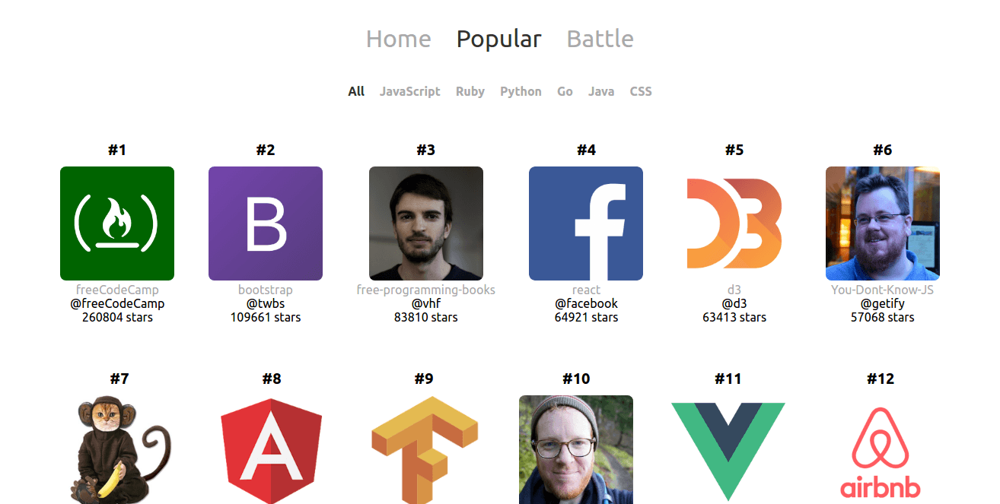
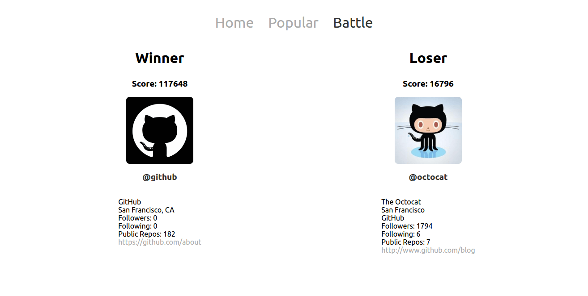

# GitHub Battle

An app that built through React.js Fundamentals course on [React Training](https://reacttraining.com). This repo contains a better version of each components separation. Written from scratch, so it has some differences with the [original version](https://github.com/ReactTraining/React-Fundamentals).

This app allows us to:

- see the welcome page with its links.
- see the most popular GitHub repos based on their languages.
- compare two GitHub account's score.





## Getting Started

### Installation

```sh
npm install
```

### Development

```sh
npm start
# this will start the webpack development server
# then the page http://localhost:8080 will be opened
```

## License

MIT
